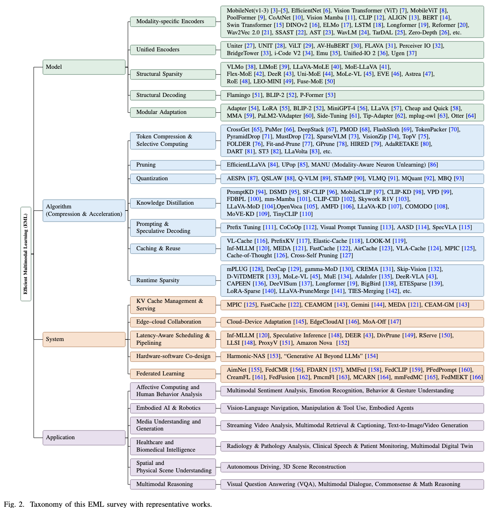
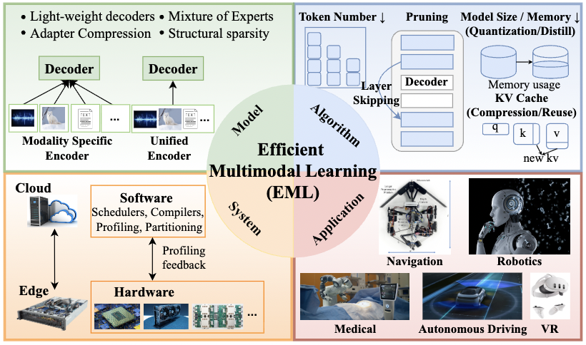
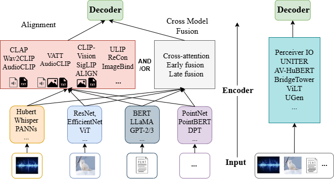
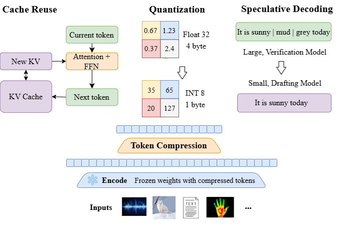
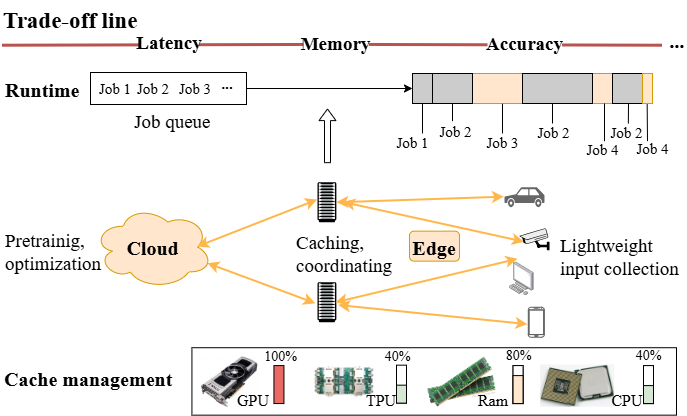

# From Models to Systems: A Comprehensive Survey of Efficient Multimodal Learning
The official GitHub page for the survey paper "From Models to Systems: A Comprehensive Survey of Efficient Multimodal Learning". And this paper is under review.

  

### Figure 1. Overall Efficient Multimodal Learning (EML) Framework

  

## Model
### Figure 3. Model-Level Efficiency Strategies

  

### Modality-specific Encoders
#### Vision Encoder
1. 2017_arXiv_Mobilenets: Efficient convolutional neural networks for mobile vision applications [arXiv](https://arxiv.org/abs/1704.04861)
2. 2018_CVPR_Shufflenet: An extremely efficient convolutional neural network for mobile devices [arXiv](https://arxiv.org/abs/1707.01083)
3. 2019_ICML_Efficientnet: Rethinking model scaling for convolutional neural networks [arXiv](https://arxiv.org/abs/1905.11946)
4. 2021_arXiv_Mobilevit: light-weight, general-purpose, and mobile-friendly vision transformer [arXiv](https://arxiv.org/abs/2110.02178)
5. 2021_NeurIPS_Coatnet: Marrying convolution and attention for all data sizes [arXiv](https://arxiv.org/abs/2106.04803)
6. 2022_CVPR_Metaformer is actually what you need for vision [arXiv](https://arxiv.org/abs/2111.11418)
7. 2020_arXiv_An image is worth 16x16 words: Transformers for image recognition at scale [arXiv](https://arxiv.org/abs/2010.11929)
8. 2021_ICCV_Swin transformer: Hierarchical vision transformer using shifted windows [arXiv](https://arxiv.org/abs/2103.14030)[ICCV](https://openaccess.thecvf.com/content/ICCV2021/papers/Liu_Swin_Transformer_Hierarchical_Vision_Transformer_Using_Shifted_Windows_ICCV_2021_paper.pdf)
9. 2021_CVPR_Masked autoencoders are scalable vision learners [arXiv](https://arxiv.org/abs/2111.06377)
10. 2022_arXiv_Beit v2: Masked image modeling with vector-quantized visual tokenizers [arXiv](https://arxiv.org/abs/2208.06366)
11. 2023_COLM_Mamba: Linear-Time Sequence Modeling with Selective State Spaces [arXiv](https://arxiv.org/abs/2312.00752)
12. 2024_arXiv_Vision mamba: Efficient visual representation learning with bidirectional state space model [arXiv](https://arxiv.org/abs/2401.09417)
13. 2024_arXiv_Kan: Kolmogorov-arnold networks [arXiv](https://arxiv.org/abs/2404.19756)
14. 2021_ICLR_Learning transferable visual models from natural language supervision [arXiv](https://arxiv.org/abs/2103.00020)
15. 2021_ICLR_Scaling up visual and vision-language representation learning with noisy text supervision [arXiv](https://arxiv.org/abs/2102.05918)
16. 2023_ICCV_Sigmoid loss for language image pre-training [arXiv](https://arxiv.org/abs/2303.15343)
17. 2021_ICCV_Emerging properties in self-supervised vision transformers [arXiv](https://arxiv.org/abs/2104.14294)
18. 2023_arXiv_Dinov2: Learning robust visual features without supervision [arXiv](https://arxiv.org/abs/2304.07193)
19. 2025_arXiv_DINOv3 [arXiv](https://arxiv.org/abs/2508.10104)
#### Text Encoders
1. 1997_NeuralComputation_Hochreiter, Sepp and Schmidhuber, Jürgen [IEEE](https://ieeexplore.ieee.org/abstract/document/6795963)
2. 2014_EMNLP_Learning phrase representations using RNN encoder-decoder for statistical machine translation [arXiv](https://arxiv.org/abs/1406.1078)
3. 2018_NAACL_Deep contextualized word representations [arXiv](https://arxiv.org/abs/1802.05365)
4. 2018_CVPR_Independently Recurrent Neural Network (IndRNN): Building A Longer and Deeper RNN [arXiv](https://arxiv.org/abs/1803.04831)
5. 2016_NeurIPS_LightRNN: Memory and computation-efficient recurrent neural networks [arXiv](https://arxiv.org/abs/1610.09893)
6. 2017_NeurIPS_Attention is all you need [arXiv](https://arxiv.org/abs/1706.03762)
7. 2019_NAACL_Bert: Pre-training of deep bidirectional transformers for language understanding [arXiv](https://arxiv.org/abs/1810.04805)
8. 2020_arXiv_Longformer: The long-document transformer [arXiv](https://arxiv.org/abs/2004.05150)
9. 2020_NeurIPS_Big Bird: Transformers for Longer Sequences [arXiv](https://arxiv.org/abs/2007.14062)
10. 2020_arXiv_Reformer: The efficient transformer [arXiv](https://arxiv.org/abs/2001.04451)
11. 2020_arXiv_Linformer: Self-Attention with Linear Complexity [arXiv](https://arxiv.org/abs/2006.04768)
12. 2023_arXiv_Llama: Open and efficient foundation language models [arXiv](https://arxiv.org/abs/2302.13971)
13. 2020_ICLR_Transformers are rnns: Fast autoregressive transformers with linear attention [arXiv](https://arxiv.org/abs/2006.16236)
14. 2025_arXiv_TextMamba: Scene Text Detector with Mamba [arXiv](https://arxiv.org/abs/2512.06657)
#### Audio Encoders
1. 2017_ICASSP_CNN ARCHITECTURES FOR LARGE-SCALE AUDIO CLASSIFICATION [arXiv](https://arxiv.org/abs/1609.09430)
2. 2020_TASLP_Panns: Large-scale pretrained audio neural networks for audio pattern recognition [arXiv](https://arxiv.org/abs/1912.10211)
3. 2020_NeurIPS_wav2vec 2.0: a framework for self-supervised learning of speech representations [arXiv](https://arxiv.org/abs/2006.11477)
4. 2021_TASLP_Hubert: Self-supervised speech representation learning by masked prediction of hidden units [arXiv](https://arxiv.org/abs/2106.07447)
5. 2021_Interspeech_AST: Audio Spectrogram Transformer [arXiv](https://arxiv.org/abs/2104.01778)
6. 2022_AAAI_SSAST: Self-Supervised Audio Spectrogram Transformer [arXiv](https://arxiv.org/abs/2110.09784)
7. 2024_Interspeech_Audio Mamba: Selective State Spaces for Self-Supervised Audio Representations [arXix](https://arxiv.org/abs/2406.02178)
8. 2022_JSTSP_WavLM: Large-Scale Self-Supervised Pre-Training for Full Stack Speech Processing [arXiv](https://arxiv.org/abs/2110.13900)
#### Thermal/Depth/Time-series
1. 2022_CVPR_Target‑aware Dual Adversarial Learning and a Multi‑scenario Multi‑Modality Benchmark to Fuse Infrared and Visible for Object Detection [arXiv](https://arxiv.org/abs/2203.16220)
2. 2024_CVPR_Flexible Window‑based Self‑attention Transformer in Thermal Image Super‑Resolution [CVPR](https://openaccess.thecvf.com/content/CVPR2024W/PBVS/papers/Jiang_Flexible_Window-based_Self-attention_Transformer_in_Thermal_Image_Super-Resolution_CVPRW_2024_paper.pdf)
3. 2023_CVPR_Lite-Mono: A Lightweight CNN and Transformer Architecture for Self-Supervised Monocular Depth Estimation [arXiv](https://arxiv.org/abs/2211.13202)
4. 2023_ICCV_MonoDETR: Depth‑guided Transformer for Monocular 3D Object Detection [arXiv](https://arxiv.org/abs/2203.13310)
5. 2021_AAAI_Informer: Beyond efficient transformer for long sequence time-series forecasting [arXiv](https://arxiv.org/abs/2012.07436)
6. 2023_COLM_Mamba: Linear-Time Sequence Modeling with Selective State Spaces [arXiv](https://arxiv.org/abs/2312.00752)
7. 2023_ICLR_Liquid Structural State-Space Models [arXiv](https://arxiv.org/abs/2209.12951)
8. 2023_CVF_Towards zero-shot scale-aware monocular depth estimation [arXiv](https://arxiv.org/abs/2306.17253)

### Unified Encoders
1. 2020_ECCV_Uniter: Universal image-text representation learning [arXiv](https://arxiv.org/abs/1909.11740)
2. 2021_ICLR_ViLT: Vision‑and‑Language Transformer Without Convolution or Region Supervision [arXiv](https://arxiv.org/abs/2102.03334)
3. 2023_AAAI_BridgeTower: Building Bridges Between Encoders in Vision-Language Representation Learning [arXiv](https://arxiv.org/abs/2206.08657)
4. 2022_arXiv_Learning audio-visual speech representation by masked multimodal cluster prediction [arXiv](https://arxiv.org/abs/2201.02184)
5. 2022_CVPR_Flava: A foundational language and vision alignment model [arXiv](https://arxiv.org/abs/2112.04482)
6. 2022_ICLR_Perceiver IO: A General Architecture for Structured Inputs \& Outputs [arXiv](https://arxiv.org/abs/2107.14795)
7. 2023_WACV_Perceiver-vl: Efficient vision-and-language modeling with iterative latent attention [arXiv](https://arxiv.org/abs/2211.11701)
8. 2024_NeurIPS_UNIT: Unifying Image and Text Recognition in One Vision Encoder [arXiv](https://arxiv.org/abs/2409.04095)
9. 2024_ICLR_Emu: Generative Pretraining in Multimodality [arXiv](https://arxiv.org/abs/2307.05222)
10. 2024_CVPR_Unified‑IO 2: Scaling Autoregressive Multimodal Models with Vision Language Audio and Action [arXiv](https://arxiv.org/abs/2312.17172)
11. 2024_NAACL_i‑Code V2: An Autoregressive Generation Framework over Vision, Language, and Speech Data [arXiv](https://arxiv.org/abs/2305.12311)
12. 2025_arXiv_UGen: Unified Autoregressive Multimodal Model with Progressive Vocabulary Learning [arXiv](https://arxiv.org/abs/2503.21193)
13. 2024_Grok-1.5 Vision: a preview of xAI’s multimodal model [XAI](https://x.ai/news/grok-1.5v)

### Structural Sparsity
1. 2022_NeurIPS_Vlmo: Unified vision-language pre-training with mixture-of-modality-experts [arXiv](https://arxiv.org/abs/2111.02358)
2. 2022_NeurIPS_Multimodal contrastive learning with limoe: the language-image mixture of experts [arXiv](https://arxiv.org/abs/2206.02770)
3. 2025_TPAMI_Uni-moe: Scaling unified multimodal llms with mixture of experts [arXiv](https://arxiv.org/abs/2405.11273)
4. 2025_arXiv_LEO-MINI: An Efficient Multimodal Large Language Model using Conditional Token Reduction and Mixture of Multi-Modal Experts [arXiv](https://arxiv.org/abs/2504.04653)
5. 2024_arXiv_Flex-moe: Modeling arbitrary modality combination via the flexible mixture-of-experts [arXiv](https://arxiv.org/abs/2410.08245)
6. 2025_CVPR_Nvila: Efficient frontier visual language models [arXiv](https://arxiv.org/abs/2412.04468)
7. 2025_arXiv_Smolvlm: Redefining small and efficient multimodal models [arXiv](https://arxiv.org/abs/2412.04468)
8. 2024_arXiv_Llava-mole: Sparse mixture of lora experts for mitigating data conflicts in instruction finetuning mllms [arXiv](https://arxiv.org/abs/2401.16160)
9. 2024_arXiv_Moe-llava: Mixture of experts for large vision-language models [arXiv](https://arxiv.org/abs/2401.15947)
10. 2024_NeurIPS_Deer-vla: Dynamic inference of multimodal large language models for efficient robot execution [arXiv](https://arxiv.org/abs/2411.02359)
11. 2025_arXiv_MoLe-VLA: Dynamic Layer-skipping Vision Language Action Model via Mixture-of-Layers for Efficient Robot Manipulation [arXiv](https://arxiv.org/abs/2503.20384)
12. 2024_AAAI_EVE: efficient vision-language pre-training with masked prediction and modality-aware moe [arXiv](https://arxiv.org/abs/2308.11971)
13. 2025_arXiv_Astrea: A MOE-based Visual Understanding Model with Progressive Alignment [arXiv](https://arxiv.org/abs/2503.09445)
14. 2024_arXiv_Routing experts: Learning to route dynamic experts in multi-modal large language models [arXiv](https://arxiv.org/abs/2407.14093)
15. 2024_arXiv_Fusemoe: Mixture-of-experts transformers for fleximodal fusion [arXiv](https://arxiv.org/abs/2402.03226)

### Structural Decoding
1. 2022_neurIPS_Flamingo: a visual language model for few-shot learning [arXiv](https://arxiv.org/abs/2204.14198)
2. 2023_ICLR_Blip-2: Bootstrapping language-image pre-training with frozen image encoders and large language models [arXiv](https://arxiv.org/abs/2301.12597)
3. 2023_NeurIPS_Bootstrapping Vision‑Language Learning with Decoupled Language Pre‑training [arXiv](https://arxiv.org/abs/2307.07063)

### Modular Adaptation
1. 2019_ICML_Parameter-efficient transfer learning for NLP [arXiv](https://arxiv.org/abs/1902.00751)
2. 2022_ICLR_Lora: Low-rank adaptation of large language models [arXiv](https://arxiv.org/abs/2106.09685)
3. 2022_CVPR_Vl-adapter: Parameter-efficient transfer learning for vision-and-language tasks [arXiv](https://arxiv.org/abs/2112.06825)
4. 2022_NeurIPS_Lst: Ladder side-tuning for parameter and memory efficient transfer learning [arXiv](https://arxiv.org/abs/2206.06522)
5. 2023_NeurIPS_Visual instruction tuning [arXiv](https://arxiv.org/abs/2304.08485)
6. 2023_arXiv_Minigpt-4: Enhancing vision-language understanding with advanced large language models [arXiv](https://arxiv.org/abs/2304.10592)
7. 2025_AAAI_A wander through the multimodal landscape: Efficient transfer learning via low-rank sequence multimodal adapter [arXiv](https://arxiv.org/abs/2412.08979)
8. 2024_CVPR_Mma: Multi-modal adapter for vision-language models [arXiv](https://arxiv.org/abs/2409.02958)
9. 2024_arXiv_PaLM2-VAdapter: progressively aligned language model makes a strong vision-language adapter [arXiv](https://arxiv.org/abs/2402.10896)
10. 2023_ICLR_Blip-2: Bootstrapping language-image pre-training with frozen image encoders and large language models [arXiv](https://arxiv.org/abs/2301.12597)
11. 2023_NeurIPS_Cheap and quick: Efficient vision-language instruction tuning for large language models [arXiv](https://arxiv.org/abs/2305.15023)
12. 2022_ECCV_Tip-adapter: Training-free adaption of clip for few-shot classification [arXiv](https://arxiv.org/abs/2207.09519)
13. 2023_arXiv_mplug-owl: Modularization empowers large language models with multimodality [arXiv](https://arxiv.org/abs/2304.14178)
14. 2025_TPAMI_Otter: A multi-modal model with in-context instruction tuning [arXiv](https://arxiv.org/abs/2305.03726)

## Algorithm

### Figure 4. Algorithm-Level Efficiency Strategies

  

### Token Compression & Selective Computing
1. 2023_arXiv_D2 pruning: Message passing for balancing diversity and difficulty in data pruning [arXiv](https://arxiv.org/abs/2310.07931)
#### Tranining-free
1. 2024_arXiv_Sparsevlm: Visual token sparsification for efficient vision-language model inference [arXiv](https://arxiv.org/abs/2410.04417)
2. 2025_AAAI_ST3: Accelerating Multimodal Large Language Model by Spatial-Temporal Visual Token Trimming [arXiv](https://arxiv.org/abs/2412.20105)
3. 2025_arXiv_Stop looking for important tokens in multimodal language models: Duplication matters more [arXiv](https://arxiv.org/abs/2502.11494)
4. 2025_CVPR_Topv: Compatible token pruning with inference time optimization for fast and low-memory multimodal vision language model [arXiv](https://arxiv.org/abs/2503.18278)
5. 2025_CVPR_Visionzip: Longer is better but not necessary in vision language models [arXiv](https://arxiv.org/abs/2412.04467)
6. 2025_arXiv_Tokencarve: Information-preserving visual token compression in multimodal large language models [arXiv](https://arxiv.org/abs/2503.10501)
7. 2024_arXiv_Multi-Stage Vision Token Dropping: Towards Efficient Multimodal Large Language Model [arXiv](https://arxiv.org/abs/2411.10803)
8. 2025_arXiv_Adaretake: Adaptive redundancy reduction to perceive longer for video-language understanding [arXiv](https://arxiv.org/abs/2503.12559)
9. 2025_arXiv_What Kind of Visual Tokens Do We Need? Training-free Visual Token Pruning for Multi-modal Large Language Models from the Perspective of Graph [arXiv](https://arxiv.org/abs/2501.02268)
10. 2024_arXiv_Pyramiddrop: Accelerating your large vision-language models via pyramid visual redundancy reduction [arXiv](https://arxiv.org/abs/2410.17247)
11. 2025_AAAI_HiRED: Attention-Guided Token Dropping for Efficient Inference of High-Resolution Vision-Language Models [arXiv](https://arxiv.org/abs/2408.10945)
12. 2025_AAAI_Fit and prune: Fast and training-free visual token pruning for multi-modal large language models [arXiv](https://arxiv.org/abs/2409.10197)
13. 2025_arXiv_Token Sequence Compression for Efficient Multimodal Computing [arXiv](https://arxiv.org/abs/2504.17892)
14. 2024_NeurIPS_Efficient large multi-modal models via visual context compression [arXiv](https://arxiv.org/abs/2406.20092)
#### Training-based
1. 2023_arXiv_PuMer: Pruning and merging tokens for efficient vision language models [arXiv](https://arxiv.org/abs/2305.17530)
2. 2024_arXiv_p-MoD: Building Mixture-of-Depths MLLMs via Progressive Ratio Decay [arXiv](https://arxiv.org/abs/2412.04449)
3. 2025_arXiv_Fast: Efficient action tokenization for vision-language-action models [arXiv](https://arxiv.org/abs/2501.09747)
4. 2024_arXiv_Tokenpacker: Efficient visual projector for multimodal llm [arXiv](https://arxiv.org/abs/2407.02392)
5. 2025_arXiv_Folder: Accelerating multi-modal large language models with enhanced performance [arXiv](https://arxiv.org/abs/2501.02430)
6. 2025_CVPR_Visionzip: Longer is better but not necessary in vision language models [arXiv](https://arxiv.org/abs/2412.04467)
7. 2024_NeurIPS_Efficient large multi-modal models via visual context compression [arXiv](https://arxiv.org/abs/2406.20092)

### Pruning
1. 2024_MM_Large multimodal model compression via iterative efficient pruning and distillation [arXiv](https://arxiv.org/abs/2312.05795)
2. 2023_arXiv_Ecoflap: Efficient coarse-to-fine layer-wise pruning for vision-language models [arXiv](https://arxiv.org/abs/2310.02998)
3. 2025_arXiv_EfficientLLaVA: Generalizable Auto-Pruning for Large Vision-language Models [arXiv](https://arxiv.org/abs/2503.15369)
4. 2023_ICLR_UPop: Unified and progressive pruning for compressing vision-language transformers [arXiv](https://arxiv.org/abs/2301.13741)
5. 2025_arXiv_Modality-Aware Neuron Pruning for Unlearning in Multimodal Large Language Models [arXiv](https://arxiv.org/abs/2502.15910)

### Quantization
1. 2024_NeurIPS_Q-vlm: Post-training quantization for large vision-language models [arXiv](https://arxiv.org/abs/2410.08119)
2. 2025_CVPR_Mbq: Modality-balanced quantization for large vision-language models [arXiv](https://arxiv.org/abs/2412.19509)
3. 2025_arXiv_Vlmq: Efficient post-training quantization for large vision-language models via hessian augmentation [arXiv](https://arxiv.org/abs/2508.03351)
4. 2025_ACM_Mquant: Unleashing the inference potential of multimodal large language models via static quaantization [arXiv](https://arxiv.org/abs/2502.00425)
5. 2025_arXiv_STaMP: Sequence Transformation and Mixed Precision for Low-Precision Activation QuantizationSTaMP: Sequence Transformation and Mixed Precision for Low-Precision Activation Quantization [arXiv](https://arxiv.org/abs/2510.26771)
6. 2024_MM_Advancing Multimodal Large Language Models with Quantization-Aware Scale Learning for Efficient Adaptation [arXiv](https://arxiv.org/abs/2408.03735)

### Caching & Reuse
1. 2024_arXiv_VL-Cache: Sparsity and Modality-Aware KV Cache Compression for Vision-Language Model Inference Acceleration [arXiv](https://arxiv.org/abs/2410.23317)
2. 2024_ECCV_Efficient inference of vision instruction-following models with elastic cache [arXiv](https://arxiv.org/abs/2407.18121)
3. 2024_arXiv_Look-m: Look-once optimization in kv cache for efficient multimodal long-context inference [arXiv](https://arxiv.org/abs/2406.18139)
4. 2024_arXiv_Cross-Self KV Cache Pruning for Efficient Vision-Language Inference [arXiv](https://arxiv.org/abs/2412.04652)
5. 2025_arXiv_Fastcache: Optimizing multimodal llm serving through lightweight kv-cache compression framework [arXiv](https://arxiv.org/abs/2503.08461)
6. 2025_arXiv_AirCache: Activating Inter-modal Relevancy KV Cache Compression for Efficient Large Vision-Language Model Inference [arXiv](https://arxiv.org/abs/2503.23956)
7. 2025_arXiv_VLA-Cache: Towards Efficient Vision-Language-Action Model via Adaptive Token Caching in Robotic Manipulation [arXiv](https://arxiv.org/abs/2502.02175)
8. 2024_arXiv_Inf-MLLM: Efficient streaming inference of multimodal large language models on a single GPU [arXiv](https://arxiv.org/abs/2409.09086)
9. 2025_arXiv_MPIC: Position-Independent Multimodal Context Caching System for Efficient MLLM Serving [arXiv](https://arxiv.org/abs/2502.01960)
10. 2025_arXiv_Cache-of-Thought: Master-Apprentice Framework for Cost-Effective Vision Language Model Inference [arXiv](https://arxiv.org/abs/2502.20587)

### Knowledge Distillation
#### Prediction-level
1. 2021_CVPR_Thinking fast and slow: Efficient text-to-visual retrieval with transformers [arXiv](https://arxiv.org/abs/2103.16553)
2. 2025_arXiv_Simple Semi-supervised Knowledge Distillation from Vision-Language Models via Dual-Head Optimization [arXiv](https://arxiv.org/html/2505.07675v1)
3. 2024_CVPR_Promptkd: Unsupervised prompt distillation for vision-language models [arXiv](https://arxiv.org/abs/2403.02781)
4. 2025_arXiv_FDBPL: Faster Distillation-Based Prompt Learning for Region-Aware Vision-Language Models Adaptation [arXiv](https://arxiv.org/abs/2505.18053)
#### Representation-level
1. 2024_CVPR_Clip-kd: An empirical study of clip model distillation [arXiv](https://arxiv.org/abs/2307.12732)
2. 2023_ICCV_Tinyclip: Clip distillation via affinity mimicking and weight inheritance [arXiv](https://arxiv.org/abs/2309.12314)
3. 2024_arXiv_Dynamic Self-adaptive Multiscale Distillation from Pre-trained Multimodal Large Model for Efficient Cross-modal Representation Learning [arXiv](https://arxiv.org/abs/2404.10838)
4. 2024_CVPR_Building vision-language models on solid foundations with masked distillation [CVPR](https://openaccess.thecvf.com/content/CVPR2024/papers/Sameni_Building_Vision-Language_Models_on_Solid_Foundations_with_Masked_Distillation_CVPR_2024_paper.pdf)
5. 2024_CVPR_Mobileclip: Fast image-text models through multi-modal reinforced training [arXiv](https://arxiv.org/abs/2311.17049)
6. 2025_arXiv_Multimodal mamba: Decoder-only multimodal state space model via quadratic to linear distillation [arXiv](https://arxiv.org/abs/2502.13145)
#### Behavior-level
1. 2025_arXiv_Skywork r1v: pioneering multimodal reasoning with chain-of-thought [arXiv](https://arxiv.org/abs/2504.05599)
2. 2024_CVPR_Visual program distillation: Distilling tools and programmatic reasoning into vision-language models [arXiv](https://arxiv.org/abs/2312.03052)
3. 2024_arXiv_Llava-mod: Making llava tiny via moe knowledge distillation [arXiv](https://arxiv.org/abs/2408.15881)

### Prompting & Speculative Decoding
1. 2022_ECCV_Visual prompt tuning [arXiv](https://arxiv.org/abs/2203.12119)
2. 2021_ACL_Prefix-Tuning: Optimizing Continuous Prompts for Generation [arXiv](https://arxiv.org/abs/2101.00190)
3. 2022_CVPR_Conditional Prompt Learning for Vision-Language Models [arXiv](https://arxiv.org/abs/2203.05557)
4. 2024_CVPR_On speculative decoding for multimodal large language models [arXiv](https://arxiv.org/abs/2404.08856)
5. 2025_DAC_AASD: Accelerate Inference by Aligning Speculative Decoding in Multimodal Large Language Models [IEEE](https://ieeexplore.ieee.org/document/11132960)
6. 2025_arXiv_Speculative decoding and beyond: An in-depth survey of techniques [arXiv](https://arxiv.org/abs/2502.19732)
7. 2025_arXiv_Spec-vla: speculative decoding for vision-language-action models with relaxed acceptance [arXiv](https://arxiv.org/abs/2507.22424)

### Runtime Sparsity
1. 2025_arXiv_Skip-Vision: Efficient and Scalable Acceleration of Vision-Language Models via Adaptive Token Skipping [arXiv](https://arxiv.org/abs/2503.21817)
2. 2023_CVPR_Dynamic inference with grounding based vision and language models [CVPR](https://openaccess.thecvf.com/content/CVPR2023/papers/Uzkent_Dynamic_Inference_With_Grounding_Based_Vision_and_Language_Models_CVPR_2023_paper.pdf)
3. 2025_arXiv_MoLe-VLA: Dynamic Layer-skipping Vision Language Action Model via Mixture-of-Layers for Efficient Robot Manipulation [arXiv](https://arxiv.org/abs/2503.20384)
4. 2024_arXiv_γ-MoD: Exploring Mixture-of-Depth Adaptation for Multimodal Large Language Models [arXiv](https://arxiv.org/abs/2410.13859)
5. 2022_arXiv_mplug: Effective and efficient vision-language learning by cross-modal skip-connections [arXiv](https://arxiv.org/abs/2205.12005)
6. 2022_CVPR_Deecap: Dynamic early exiting for efficient image captioning [CVPR](https://openaccess.thecvf.com/content/CVPR2022/papers/Fei_DeeCap_Dynamic_Early_Exiting_for_Efficient_Image_Captioning_CVPR_2022_paper.pdf)
7. 2023_CVPR_You need multiple exiting: Dynamic early exiting for accelerating unified vision language model [arXiv](https://arxiv.org/abs/2211.11152)
8. 2024_NeurIPS_Deer-vla: Dynamic inference of multimodal large language models for efficient robot execution [arXiv](https://arxiv.org/abs/2411.02359)
9. 2024_arXiv_Not all layers of llms are necessary during inference [arXiv](https://arxiv.org/abs/2403.02181)
10. 2024_arXiv_Crema: Generalizable and efficient video-language reasoning via multimodal modular fusion [arXiv](https://arxiv.org/abs/2402.05889)
11. 2024_arXiv_CAPEEN: Image Captioning with Early Exits and Knowledge Distillation [arXiv](https://arxiv.org/abs/2410.04433)
12. 2021_NAACL_Multimodal End‑to‑End Sparse Model for Emotion Recognition [arXiv](https://arxiv.org/abs/2103.09666)
13. 2024_CVPR_Low‑Rank Approximation for Sparse Attention in Multi‑Modal LLMs [CVPR](https://openaccess.thecvf.com/content/CVPR2024/papers/Song_Low-Rank_Approximation_for_Sparse_Attention_in_Multi-Modal_LLMs_CVPR_2024_paper.pdf)
14. 2023_NeurIPS_Ties-merging: Resolving interference when merging models [arXiv](https://arxiv.org/abs/2306.01708)
15. 2023_arXiv_An empirical study of multimodal model merging [arXiv](https://arxiv.org/abs/2304.14933)
16. 2024_arXiv_Llava-prumerge: Adaptive token reduction for efficient large multimodal models [arXiv](https://arxiv.org/abs/2403.15388)

## System

### Figure 5. System-Level Efficiency Strategies

  

### KV Cache Management & Serving
1. 2025_arXiv_Characterizing and Efficiently Accelerating Multimodal Generation Models [arXiv](https://arxiv.org/abs/2410.00215)
2. 2025_arXiv_Fastcache: Optimizing multimodal llm serving through lightweight kv-cache compression framework [arXiv](https://arxiv.org/abs/2503.08461)
3. 2025_arXiv_Meda: Dynamic kv cache allocation for efficient multimodal long-context inference [arXiv](https://arxiv.org/abs/2502.17599)
4. 2025_arXiv_MPIC: Position-Independent Multimodal Context Caching System for Efficient MLLM Serving [arXiv](https://arxiv.org/abs/2502.01960)
5. 2024_arXiv_Gemini 1.5: Unlocking multimodal understanding across millions of tokens of context [arXiv](https://arxiv.org/abs/2403.05530)

### Edge–cloud Collaboration
1. 2024_MobiCom_EdgeCloudAI: Edge-Cloud Distributed Video Analytics [ACM](https://dl.acm.org/doi/10.1145/3636534.3698857)
2. 2025_arXiv_MoA-Off: Adaptive Heterogeneous Modality-Aware Offloading with Edge-Cloud Collaboration for Efficient Multimodal LLM Inference [arXiv](https://arxiv.org/abs/2509.16995)
3. 2020_MobiCom_Challenge: COSMOS: A city-scale programmable testbed for experimentation with advanced wireless [ACM](https://dl.acm.org/doi/10.1145/3372224.3380891)
4. 2023_CVPR_Cloud-Device Collaborative Adaptation to Continual Changing Environments in the Real-world [arXiv](https://arxiv.org/abs/2212.00972)

### Latency-Aware Scheduling & Pipelining
1. 2025_arXiv_RServe: Overlapping Encoding and Prefill for Efficient LMM Inference [arXiv](https://arxiv.org/abs/2509.24381)
2. 2024_arXiv_Inf-MLLM: Efficient streaming inference of multimodal large language models on a single GPU [arXiv](https://arxiv.org/abs/2409.09086)
3. 2023_NeurIPS_H2o: Heavy-hitter oracle for efficient generative inference of large language models [arXiv](https://arxiv.org/abs/2306.14048)
4. 2025_TAAS_Adaptive Scheduling of Multimodal Large Language Model in Intelligent Edge Computing [ACM](https://dl.acm.org/doi/abs/10.1145/3774908)
5. 2025_arXiv_The Amazon Nova Family of Models: Technical Report and Model Card [arXiv](https://arxiv.org/abs/2506.12103)

### Hardware-software Co-design
1. 2024_ISPASS_Generative AI Beyond LLMs: System Implications of Multi-Modal Generation [arXiv](https://arxiv.org/abs/2312.14385)
2. 2023_ACML_Harmonic-NAS: Hardware-Aware Multimodal Neural Architecture Search on Resource-constrained Devices [arXiv](https://arxiv.org/abs/2309.06612)

### Federated Learning
1. 2023_ICLR_FedCLIP: Fast Generalization and Personalization for CLIP in Federated Learning [arXiv](https://arxiv.org/abs/2302.13485)
2. 2023_WWW_pFedPrompt: Learning Personalized Prompt for Vision-Language Models in Federated Learning [ACM](https://dl.acm.org/doi/10.1145/3543507.3583518)
3. 2023_ICLR_Multimodal Federated Learning via Contrastive Representation Ensemble [arXiv](https://arxiv.org/abs/2302.08888)
4. 2025_Neural Networks_FedMEKT: Distillation-Based Embedding Knowledge Transfer for Multimodal Federated Learning [arXiv](https://arxiv.org/abs/2307.13214) [ACM](https://dl.acm.org/doi/10.1016/j.neunet.2024.107017)
5. 2021_SIGIR_FedCMR: Federated Cross-Modal Retrieval [ACM](https://dl.acm.org/doi/10.1145/3404835.3462989)
6. 2023_arXiv_Multimodal Federated Learning with Missing Modality via Prototype Mask and Contrast [arXiv](https://arxiv.org/abs/2312.13508)
7. 2024_arXiv_Communication-Efficient Multimodal Federated Learning: Joint Modality and Client Selection [arXiv](https://arxiv.org/html/2401.16685v1)
8. 2022_AAAI_Cross-Modal Federated Human Activity Recognition via Modality-Agnostic and Modality-Specifc Representation Learning [AAAI](https://ojs.aaai.org/index.php/AAAI/article/view/20213)
9. 2024_TPAMI_Cross-Modal Federated Human Activity Recognition [IEEE](https://ieeexplore.ieee.org/document/10440498)

## Application
### Figure 6. Efficient Multimodal LLMs Landscape

  

### Affective Computing and Human Behavior Analysis
1. 2025_AAAI_DLF: Disentangled-language-focused multimodal sentiment analysis [arXiv](https://arxiv.org/abs/2412.12225)
2. 2024_NIPS_arxiv_Ugotme: An embodied system for affective human-robot interaction [arXiv](https://arxiv.org/abs/2410.18373)

### Embodied AI & Robotics
1. 2018_NeurIPS_Speaker-follower models for vision-and-language navigation [arXiv](https://arxiv.org/abs/1806.02724)
2. 2022_CoRL_A persistent spatial semantic representation for high-level natural language instruction execution [arXiv](https://arxiv.org/abs/2107.05612)
3. 2022_AAAI_Teach: Task-driven embodied agents that chat [arXiv](https://arxiv.org/abs/2110.00534)
4. 2023_CoRL_Do as i can, not as i say: Grounding language in robotic affordances [arXiv](https://arxiv.org/abs/2204.01691)
5. 2025_arXiv_CrayonRobo: Object-Centric Prompt-Driven Vision-Language-Action Model for Robotic Manipulation [arXiv](https://arxiv.org/abs/2505.02166)
6. 2023_CoRL_Rt-2: Vision-language-action models transfer web knowledge to robotic control [arXiv](https://arxiv.org/abs/2307.15818)
7. 2024_arXiv_Openvla: An open-source vision-language-action model [arXiv](https://arxiv.org/abs/2406.09246)

### Media Understanding and Generation
1. 2021_EMNLP_VideoCLIP: Contrastive Pre-training for Zero-shot Video-Text Understanding [arXiv](https://arxiv.org/abs/2109.14084)
2. 2024_arXiv_Towards Bridging the Cross-modal Semantic Gap for Multi-modal Recommendation [arXiv](https://arxiv.org/abs/2407.05420)
3. 2023_CVPR_Vop: Text-video co-operative prompt tuning for cross-modal retrieval [arXiv](https://arxiv.org/abs/2211.12764)
4. 2024_ACL_Video-ChatGPT: Towards Detailed Video Understanding via Large Vision and Language Models [arXiv](https://arxiv.org/abs/2306.05424)
5. 2024_CVPR_MVBench: A Comprehensive Multi-modal Video Understanding Benchmark [arXiv](https://arxiv.org/abs/2311.17005)
6. 2024_arXiv_Video-MME: The First-Ever Comprehensive Evaluation Benchmark of Multi-modal LLMs in Video Analysis [arXiv](https://arxiv.org/abs/2405.21075)
7. 2022_ECCV_End-to-end active speaker detection [arXiv](https://arxiv.org/abs/2203.14250)
8. 2023_CVPR_A light weight model for active speaker detection [arXiv](https://arxiv.org/abs/2303.04439)

### Healthcare and Biomedical Intelligence
1. 2023_CVPR_Learning to exploit temporal structure for biomedical vision-language processing [arXiv](https://arxiv.org/abs/2301.04558)
2. 2024_MICCAI_KARGEN: Knowledge-Enhanced Automated Radiology report generation using large language models [arXiv](https://arxiv.org/abs/2409.05370)
3. 2025_springer_CXR-LLAVA: a multimodal large language model for interpreting chest X-ray images [arXiv](https://arxiv.org/abs/2310.18341)
4. 2023_NeurIPS_Llava-med: Training a large language-and-vision assistant for biomedicine in one day [arXiv](https://arxiv.org/abs/2306.00890)
5. 2024_SenSys_Advancing PPG-based continuous blood pressure monitoring from a generative perspective [ACM](https://dl.acm.org/doi/10.1145/3666025.3699365)

### Spatial and Physical Scene Understanding
1. 2019_CVPR_Pointpillars: Fast encoders for object detection from point clouds [arXiv](https://arxiv.org/abs/1812.05784)
2. 2023_ICRA_BEVFusion: Multi-Task Multi-Sensor Fusion with Unified Bird's-Eye View Representation [arXiv](https://arxiv.org/abs/2205.13542)
3. 2021_ITSC_Fusionpainting: Multimodal fusion with adaptive attention for 3d object detection [arXiv](https://arxiv.org/abs/2106.12449)
4. 2023_ICCV_On-device real-time custom hand gesture recognition [arXiv](https://arxiv.org/abs/2309.10858)

### Multimodal Reasoning
1. 2019_arXiv_Lxmert: Learning cross-modality encoder representations from transformers [arXiv](https://arxiv.org/abs/1908.07490)
2. 2020_ECCV_Uniter: Universal image-text representation learning [arXiv](https://arxiv.org/abs/1909.11740)
3. 2023_IGARSS_Lit-4-rsvqa: Lightweight transformer-based visual question answering in remote sensing [arXiv](https://arxiv.org/abs/2306.007580)
4. 2023_arXiv_Llava-interactive: An all-in-one demo for image chat, segmentation, generation and editing [arXiv](https://arxiv.org/abs/2311.00571)
5. 2023_arXiv_Minigpt-4: Enhancing vision-language understanding with advanced large language models [arXiv](https://arxiv.org/abs/2304.10592)
6. 2024_arXiv_Mathglm-vision: solving mathematical problems with multi-modal large language model [arXiv](https://arxiv.org/abs/2409.13729)
7. 2023_ICCV_ViperGPT: Visual Inference via Python Execution for Reasoning [arXiv](https://arxiv.org/abs/2303.08128)
